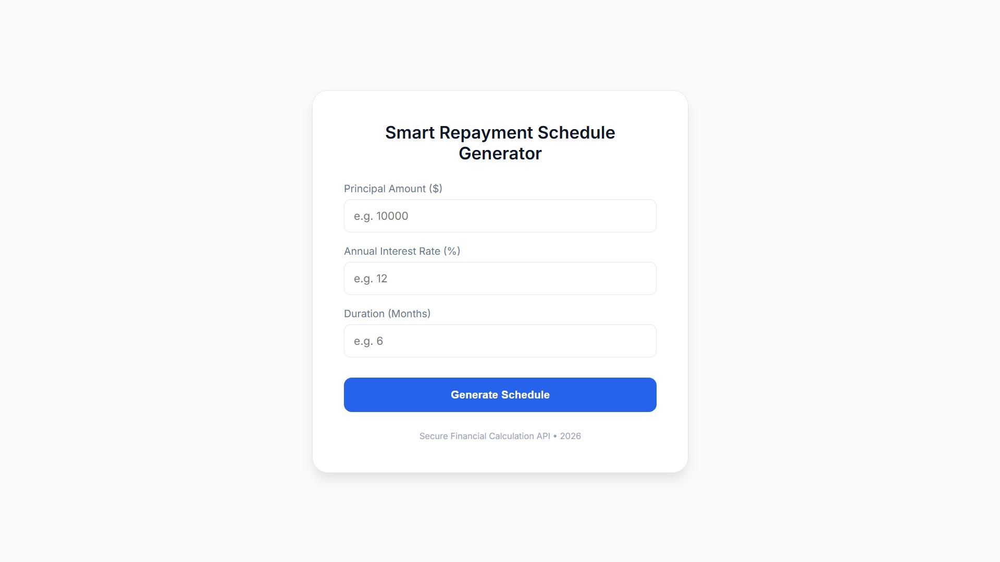
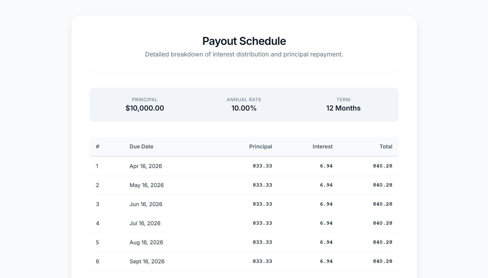

# 💸 Fintech Payout Engine

A high-performance **.NET 8 Web API** micro-service designed for precision financial scheduling. This engine automates the calculation of repayment schedules and interest distribution for debt-based crowdfunding models.

## 🚀 Overview
In the fintech industry, precision and transparency are paramount. This project addresses the challenge of manual payout calculations by providing a reliable, automated **RESTful API** that generates a detailed amortization schedule based on principal, annual rates, and duration.

## ✨ Key Features
* **High-Precision Calculations:** Utilizes the `decimal` type to ensure zero-loss accuracy in financial transactions.
* **Modern Minimal UI:** A built-in, responsive dashboard for easy data entry.
* **Dynamic Schedule Generation:** Automatically calculates monthly principal and interest breakdown with due dates.

## 🛠️ Tech Stack
* **Framework:** .NET 8 (ASP.NET Core)
* **Language:** C#
* **Frontend:** HTML5 / CSS3 
* **API Style:** RESTful API

## 📸 Screenshots
**Home Page:** Simple & Formal input form.
> 

**Dynamic Payout Schedule:** Automating interest calculations with a professional, easy-to-read financial summary.
> 


## ⚙️ How to Run
1. Clone the repository:
   ```bash
   git clone [https://github.com/latifahTech/Fintech-Payout-Engine.git](https://github.com/latifahTech/Fintech-Payout-Engine.git)
